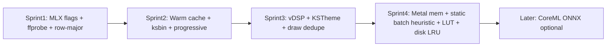

# KirtanSplitter — План оптимизации (Grok v3)

> Документ Grok (xAI). Рядом с `OPTIMIZATION_PLAN.md` (Claude Code).  
> v3 учитывает рецензию Claude на Grok-план: auto_tune UX, отказ от `.metallib`, больше псевдокода.

## Context

KirtanSplitter — macOS SwiftUI + Python backend, inference через **`mlx-audio-separator` → MLX/Metal**.

План объединяет:
- разбор кодовой базы (Grok);
- `OPTIMIZATION_PLAN.md` (Claude Code) — конкретные реализации;
- **рецензию Claude на Grok-план** (см. ниже) — исправления UX/приоритетов.

**Цели:**
1. **Производительность** — модели; hybrid CPU+GPU+NPU где реально; иначе memory.
2. **Дизайн** — минималистичный studio UI.
3. **Визуализация** — first paint как SpectraLayers/RX (доли секунды).

**Companion files in repo root:**
| File | Author |
|------|--------|
| `OPTIMIZATION_PLAN.md` | Claude Code |
| `OPTIMIZATION_PLAN_GROK.md` | Grok (синхронизируется с этим планом) |

---

## Feedback Claude → что меняем в Grok-плане

| Замечание Claude | Вердикт | Действие в v3 |
|------------------|---------|----------------|
| `auto_tune_batch` ~8s probe на Separate «зависнет» | **Согласны** | **Не включать auto_tune на hot path.** Static batch по RAM; probe только offline/benchmark; использовать **уже существующий** `_tuning_cache` lib только если cache hit, иначе skip |
| Precompile `.metallib` — +5–10ms, усложняет build | **Согласны** | **Убрать из roadmap / Later-only.** Runtime `makeLibrary(source:)` оставляем |
| Меньше конкретного кода, чем у Claude | **Согласны** | Добавить **псевдокод** binary format, warm Separator, KSTheme, progressive protocol (ниже) |
| Идеал = Grok architecture + Claude concrete | **Принимаем** | Этот v3 — **merged roadmap** |

---

## Baseline (кратко)

| Слой | Сейчас | Узкое место |
|------|--------|-------------|
| RoFormer inference | MLX/Metal | experimental flags off; new Separator each run; batch=1 |
| NPU/ANE | status only | RoFormer на ANE нереалистичен; ONNX runner не wired |
| Preview | numpy FFT + huge JSON | 2–5s, not RX-class |
| Spectrogram draw | Metal fragment | fast; JSON/transpose slow |

Ключ: `engine.py`, `jobs.py`, `audio_analysis.py`; Swift `BackendClient`, `AudioPreview*`, `MetalSpectrogram*`.

---

## 1. Производительность — hybrid CPU / GPU / NPU

### 1.0 Hybrid verdict

| Компонент | Процессор |
|-----------|-----------|
| RoFormer / MDXC | **Metal GPU (MLX)** |
| ONNX drums (future) | **CoreML GPU+ANE** (optional later) |
| Preview FFT/peaks | **Accelerate/vDSP → Metal texture** |
| Decode/conform | **CPU ffmpeg** (меньше вызовов) |

ANE для BS-RoFormer: **no** (RoPE + dynamic shapes). Memory path если NPU нет.

---

### 1.1 Experimental MLX flags *(P0)*

**Проблема:** `engine.py` hard-codes experimental `False`.

**План:**
1. Flags → `SeparationJob` / process presets.
2. Benchmark + SDR sanity по одному флагу.
3. Presets **Metal Fast** (safe) / **Metal Max** (compile + fallback on OOM).
4. UI advanced toggles optional.

**Не включать `auto_tune_batch=true` в Metal presets по умолчанию** (см. 1.4).

Ожидание: ~10–30% (подтвердить `script/benchmark_models.py`).

---

### 1.2 Warm Separator cache *(P0)* — concrete

```python
# engine.py — pseudo
class MlxSeparatorEngine:
    def __init__(self, model_dir, logger=None):
        ...
        self._cached_separator = None
        self._cached_model_filename = None
        self._cached_fingerprint = None  # segment/batch/speed/perf flags

    def _separator_fingerprint(self, job: SeparationJob) -> str:
        return "|".join([
            job.model_filename,
            str(job.mdxc_segment_size),
            str(job.mdxc_batch_size),
            job.speed_mode,
            job.cache_clear_policy,
            # stable hash of experimental performance_params
        ])

    def _get_or_load_separator(self, job, progress):
        fp = self._separator_fingerprint(job)
        if (
            self._cached_separator is not None
            and self._cached_model_filename == job.model_filename
            and self._cached_fingerprint == fp
        ):
            return self._cached_separator, True  # hot

        separator = Separator(model_file_dir=self.model_dir, ...)
        self._load_model(separator, job.model_filename)
        self._cached_separator = separator
        self._cached_model_filename = job.model_filename
        self._cached_fingerprint = fp
        return separator, False

    def invalidate_model_cache(self, reason: str = ""):
        self._cached_separator = None
        self._cached_model_filename = None
        self._cached_fingerprint = None
```

- Invalidate: model change, OOM, cancel+restart backend.
- Runtime stats: `"modelHot": true/false`.

**Ожидание:** −3–8s на 2-й+ трек той же модели.

---

### 1.3 Metal allocator *(P1)*

```python
# runtime.py or engine startup
import mlx.core as mx
import os

def configure_mlx_memory():
    page = os.sysconf("SC_PAGE_SIZE")
    pages = os.sysconf("SC_PHYS_PAGES")
    total = page * pages
    mem_limit = int(os.environ.get("KIRTAN_MLX_MEMORY_LIMIT_BYTES", total * 0.8))
    cache_limit = int(os.environ.get("KIRTAN_MLX_CACHE_LIMIT_BYTES", int(1.5 * 1024**3)))
    if hasattr(mx, "metal"):
        mx.metal.set_memory_limit(mem_limit)
        mx.metal.set_cache_limit(cache_limit)
```

---

### 1.4 Batch sizing — **без 8s hang на Separate** *(P0 policy, Claude fix)*

**Проблема Claude:** probe `auto_tune_batch` ≈ `tune_probe_seconds` (default 8s) × candidates × 2 runs — пользователь жмёт Separate и «зависает».

**Факт lib:** `_tuning_cache` + `save_tuning_cache` уже есть — повторный hit быстрый; **cold miss** дорогой.

**Правила v3:**
1. **Hot path Separate:** `auto_tune_batch=False` всегда по умолчанию.
2. **Static heuristic** (мгновенно):
   - RAM &lt; 16 GB → batch 1
   - 16–31 GB → batch 2
   - ≥32 GB → batch 2–4 (по model family)
3. **Cache-only auto_tune:** если lib `_tuning_cache` уже имеет key → можно применить; **не** запускать probe inline.
4. **Offline tune:** `script/benchmark_models.py --auto-tune` или Settings «Calibrate batch…» (background, progress UI).
5. Metal Max **не** включает auto_tune; только experimental kernels + static/higher batch.

```python
# jobs / engine — pseudo
def resolve_batch_size(job, total_ram_bytes, tuning_cache_hit: int | None) -> int:
    if job.mdxc_batch_size_explicit:
        return job.mdxc_batch_size
    if tuning_cache_hit is not None:
        return tuning_cache_hit
    gb = total_ram_bytes / (1024**3)
    if gb >= 32:
        return 2  # or 4 for lighter MDXC; RoFormer start at 2
    if gb >= 16:
        return 2
    return 1
```

---

### 1.5 I/O hygiene *(P1)*

| Win | Detail |
|-----|--------|
| One ffprobe JSON | replace 4 probes in `_source_audio_format` (~−300ms) |
| Skip stereo prep | if channels==2 |
| Skip conform | if output already matches source format |
| WAV intermediate | FLAC final only if requested |

```python
# engine.py — single probe pseudo
def _source_audio_format(self, path: Path) -> AudioFormatSpec:
    payload = json.loads(subprocess.check_output([
        "ffprobe", "-v", "error", "-select_streams", "a:0",
        "-show_entries", "stream=channels,sample_rate,bits_per_raw_sample,bits_per_sample,sample_fmt,codec_name",
        "-of", "json", str(path),
    ], text=True, timeout=20))
    stream = (payload.get("streams") or [{}])[0]
    return AudioFormatSpec(
        channels=int(stream.get("channels") or 0) or None,
        sample_rate=int(stream.get("sample_rate") or 0) or None,
        bit_depth=_bit_depth_from_stream(stream),
        codec_name=stream.get("codec_name"),
    )
```

---

### 1.6 Disk / NPU *(P2)*

- .ckpt cleanup UX after conversion.
- CoreML ONNX runner optional later; no PolarFormer static export in this cycle.

---

### 1.7 Verification (models)

- Benchmark baseline vs Metal Fast vs Metal Max (**without** cold auto_tune on path).
- Unit: warm-cache hit/miss; single ffprobe; batch heuristic; auto_tune never called in default job.

---

## 2. Визуализация — RX speed

**Targets:** waveform **&lt;100–300ms**; useful spectrogram **&lt;1s** progressive.

### 2.1 Bottleneck

Mega JSON of ~1.8M doubles + CPU FFT + transpose — not Metal draw.

### 2.2 Strategy

1. **Sprint 2:** binary `.ksbin` + mmap + progressive (Claude 3.1/3.3) — low risk.
2. **Sprint 3:** Swift vDSP local STFT for typical tracks — RX-class.
3. Row-major from producer (kill CPU transpose).
4. **No `.metallib` build step** (Claude feedback).

---

### 2.3 Binary protocol *(P0)* — concrete (from Claude, adopted)

**Python write:**

```python
# audio_analysis.py
import struct, tempfile
import numpy as np

KSBIN_VERSION = 1

def write_analysis_ksbin(waveform: np.ndarray, spectrogram: np.ndarray,
                         columns: int, bins: int) -> str:
    """waveform: float32 [N]; spectrogram: float32 [bins, columns] row-major."""
    fd, path = tempfile.mkstemp(suffix=".ksbin", prefix="kirtan-preview-")
    with os.fdopen(fd, "wb") as f:
        # header: version u8 | waveform_count u32 | columns u32 | bins u32
        f.write(struct.pack("<BIII", KSBIN_VERSION, waveform.size, columns, bins))
        np.asarray(waveform, dtype=np.float32).tofile(f)
        # row-major: for each bin, all columns — matches Metal texture rows
        np.asarray(spectrogram, dtype=np.float32).reshape(bins, columns).tofile(f)
    return path

def analyze_audio_for_client(...):
    analysis = analyze_audio(...)  # or phased
    wave = np.asarray(analysis["waveformPeaks"], dtype=np.float32)
    # reshape flat values → row-major if needed
    spec = np.asarray(analysis["spectrogram"]["values"], dtype=np.float32)
    # Prefer producing row-major in _spectrogram already:
    # return matrix.T.reshape(-1)  # if was column-major flatten
    bin_path = write_analysis_ksbin(wave, spec.reshape(bins, columns), columns, bins)
    meta = {k: v for k, v in analysis.items() if k not in ("waveformPeaks", "spectrogram")}
    meta["binaryPayloadPath"] = bin_path
    meta["spectrogram"] = {"columns": columns, "bins": bins, "layout": "row_major_bin_rows"}
    return meta
```

**Swift read:**

```swift
// BackendClient / AudioAnalysis decoder — pseudo
struct KSBinHeader {
    var version: UInt8
    var waveformCount: UInt32
    var columns: UInt32
    var bins: UInt32
}

func loadAnalysis(meta: AnalysisMeta) throws -> AudioAnalysis {
    let url = URL(fileURLWithPath: meta.binaryPayloadPath)
    let data = try Data(contentsOf: url, options: .mappedIfSafe)
    defer { try? FileManager.default.removeItem(at: url) }

    let headerSize = 1 + 4 + 4 + 4
    let header = data.withUnsafeBytes { buf -> KSBinHeader in
        // little-endian unpack
        ...
    }
    let waveBytes = Int(header.waveformCount) * MemoryLayout<Float>.size
    let waveStart = headerSize
    let peaks: [Float] = data.subdata(in: waveStart..<(waveStart + waveBytes)).withUnsafeBytes {
        Array($0.bindMemory(to: Float.self))
    }
    let specStart = waveStart + waveBytes
    let floats: [Float] = data.subdata(in: specStart..<data.count).withUnsafeBytes {
        Array($0.bindMemory(to: Float.self))  // already row-major → texture.replace without transpose
    }
    return AudioAnalysis(..., waveformPeaks: peaks.map(Double.init), spectrogram: .init(
        columns: Int(header.columns), bins: Int(header.bins), values: floats.map(Double.init)
        // later: keep [Float] end-to-end
    ))
}
```

Optional later: **uint8** spectrogram (0–1 × 255) → ~4× smaller.

---

### 2.4 Progressive protocol *(P0)* — concrete

```json
// phase 1 — fast JSON, no binary needed
{"type":"response","id":"...","result":{
  "phase":"waveform_preview",
  "durationSeconds":312.5,"channels":2,"sampleRate":44100,"peakDb":-1.2,
  "waveformPeaks":[/* 512 floats */]
}}

// phase 2 — progress event
{"type":"progress","id":"...","stage":"waveform_full","result":{
  "phase":"waveform_full","binaryPayloadPath":"/tmp/kirtan-preview-wave.bin"
}}

// phase 3 — chunks
{"type":"progress","id":"...","stage":"spectrogram_chunk","result":{
  "phase":"spectrogram_chunk",
  "chunkIndex":0,"totalChunks":8,
  "columnsStart":0,"columnsCount":1024,"bins":224,
  "binaryPayloadPath":"/tmp/kirtan-preview-spec-0.bin"
}}
```

UI: paint phase1 immediately; morph wave; fill spectrogram L→R; shimmer while empty.

---

### 2.5 vDSP path *(P1)*

```swift
// pseudo — local spectrogram
import Accelerate

func spectrogramTexture(pcm: [Float], sampleRate: Int, columns: Int, bins: Int, device: MTLDevice) -> MTLTexture {
    // window, vDSP.FFT radix2, magnitude, log normalize → Float buffer
    // texture descriptor .r16Float or .r8Unorm, replace region — no Python JSON
}
```

Fallback for huge files: keep Python chunked analysis + ksbin.

---

### 2.6 Cache *(P1)*

- LRU 20 / ~256MB.
- Disk `~/Library/Caches/KirtanSplitter/previews/`.
- Key `SHA256(path|size|mtime|algo|resolution)`.

### 2.7 Colormap / axes *(P2)*

- LUT Magma/Inferno/Viridis; Hz axis; optional mel.

### 2.8 Explicitly deferred

- **`.metallib` precompile** — not worth build complexity for ms-scale gain (Claude).

---

## 3. Дизайн

### 3.1 Tokens *(P0/P1)* — concrete

```swift
// Sources/KirtanSplitterApp/Models/DesignTokens.swift
import SwiftUI

enum KSTheme {
    static let canvasBackground = Color(red: 0.015, green: 0.018, blue: 0.026)
    static let panelBackground  = Color(red: 0.05, green: 0.06, blue: 0.08)
    static let surfaceBackground = Color(red: 0.08, green: 0.10, blue: 0.14)

    static let accent        = Color.orange
    static let waveformBlue  = Color(red: 0.18, green: 0.55, blue: 1.0)
    static let playheadAmber = Color(red: 1.0, green: 0.74, blue: 0.18)
    static let clippingRed   = Color(red: 1.0, green: 0.22, blue: 0.20)

    static let spacingXS: CGFloat = 4
    static let spacingSM: CGFloat = 8
    static let spacingMD: CGFloat = 12
    static let spacingLG: CGFloat = 16
    static let spacingXL: CGFloat = 20

    static let radiusSM: CGFloat = 6
    static let radiusMD: CGFloat = 10
    static let radiusLG: CGFloat = 14
}
```

Replace hardcoded RGB in `AudioPreviewPane`, `ContentView`, rail, comparison.

### 3.2 Visual direction

Quieter header; thin selection accent; studio-dark plot + light material frame; shimmer loading; layer chips.

### 3.3 Dedupe *(P1)*

`AudioDrawingUtilities.swift` — shared wave/grid/axes/playhead; `StemAppearance.swift`.

---

## Sprint order (merged ideal roadmap)



### Sprint 1 (1–2d)
- Experimental flags + Metal Fast/Max + benchmark
- Single ffprobe
- Row-major spectrogram (no transpose)

### Sprint 2 (3–5d)
- Warm Separator (pseudocode above)
- Binary ksbin + mmap
- Progressive phases
- KSTheme file scaffold

### Sprint 3 (5–7d)
- vDSP analysis path
- Draw utilities dedupe
- Theme applied + progressive UI polish

### Sprint 4 (3–5d)
- MLX memory limits
- Static RAM batch heuristic (**not** cold auto_tune)
- Colormap LUT + disk LRU cache
- Optional glass/micro-anim

### Later
- Offline/Settings batch calibration (auto_tune only here)
- CoreML ONNX for drums
- ~~metallib~~ skipped

---

## Success metrics

| Metric | Target |
|--------|--------|
| 2nd track same model | −3–8s warm cache |
| Experimental flags | measure 10–30% |
| First Separate with Metal Fast | **no +8s probe** |
| Waveform first paint | &lt;100–300ms |
| Useful spectrogram | &lt;1s progressive |
| UI | one `KSTheme` source |

---

## Critical files

**Backend:** `engine.py`, `jobs.py`, `process_presets.py`, `audio_analysis.py`, `protocol.py`, `runtime.py`  
**Swift:** `BackendClient.swift`, `AudioPreview*`, `MetalSpectrogram*`, `ContentView.swift`, new `DesignTokens.swift`, `AudioDrawingUtilities.swift`  
**Tooling:** `script/benchmark_models.py`, tests

---

## Non-goals

- ANE for RoFormer
- PolarFormer static CoreML this cycle
- New inference stack outside mlx-audio-separator
- Runtime→build `.metallib` migration
- Default-on cold `auto_tune_batch` on Separate

---

## Merge summary (Claude + Grok)

| From Claude | From Grok | Policy |
|-------------|-----------|--------|
| Binary protocol pseudocode | Extended MLX experimental set | both |
| Separator cache idea | Fingerprint + modelHot UI | both |
| DesignTokens/KSTheme concrete | Metal Fast/Max presets | both |
| Progressive phases | RX timing budgets | both |
| ANE honesty | Hybrid CPU/GPU/NPU table | both |
| — | auto_tune default-off + cache-only | **Claude critique applied** |
| — | drop metallib priority | **Claude critique applied** |
