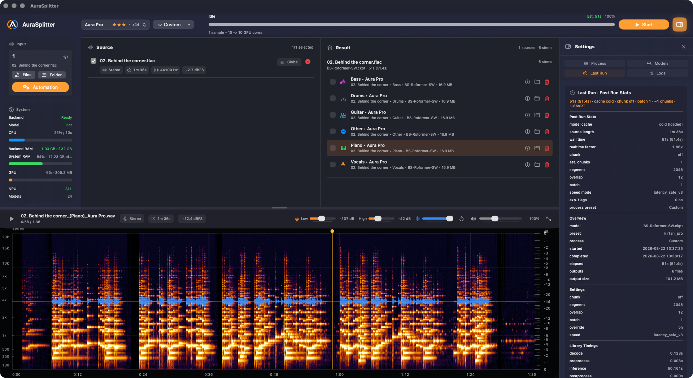
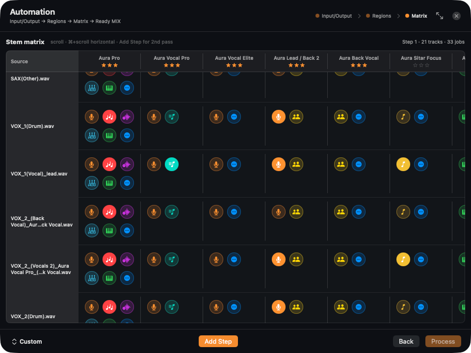

<p align="center">
  
  
</p>

<h1 align="center">Aura Splitter</h1>

<p align="center">
  <strong>Professional audio stem separation for Apple Silicon.</strong><br>
  <em>Full-GPU inference. Batch processing. Your audio never leaves your Mac.</em>
</p>

<p align="center">
  <a href="https://github.com/Pavan-Gopa/AuraSplitter/releases/latest/download/AuraSplitter-arm64.dmg"></a>
</p>

<p align="center">
  <a href="https://github.com/Pavan-Gopa/AuraSplitter/releases/latest"></a>
  
  
  
  
  
</p>

<p align="center">
  <a href="#see-it-in-action">Screenshots</a> ·
  <a href="#why-aura-splitter">Why</a> ·
  <a href="#features">Features</a> ·
  <a href="#the-model-lineup">Models</a> ·
  <a href="#install">Install</a> ·
  <a href="#auto-updates">Updates</a>
</p>

---

## See it in action

<p align="center">
  
</p>
<p align="center">
  <em>Main workspace — drop a whole folder of recordings and watch clean stems appear.</em>
</p>

<p align="center">
  
</p>
<p align="center">
  <em>The automation wizard — map every stem to its final name without touching the terminal.</em>
</p>

## Why Aura Splitter

Most AI separators either run in the cloud on someone else's GPU or crawl through CPU-bound pipelines. **Aura Splitter is a native macOS app built around one idea: every heavy operation runs on the M-series GPU via MLX/Metal** — spectrograms, model forward passes, all of it.

It was forged on the hardest material a separator can face: hours of raw live recordings — crowd bleed, room reverb, blown-out phone mics. If it handles those, it handles yours.

- **Batch-first.** Drop ten files or a hundred; the queue processes them one by one with live per-chunk progress.
- **Serious models.** BS-Roformer, ViperX, MDX23C and MVSep Mega checkpoints — the same families topping UVR leaderboards.
- **Zero cloud.** Audio never leaves your machine. No accounts, no uploads, no API keys.
- **Real previews.** Waveform + spectrogram player per stem, so you *hear* the result before committing to it.

## Features

### Separation engine

- MLX/Metal inference through `mlx-audio-separator` — no PyTorch, no ONNX Runtime at inference time.
- Presets from quick karaoke splits to a full 6-stem breakdown (`Aura Pro`).
- Two-pass pipelines: clean vocals first, then re-separate what remains (lead/back, drums, SFX).
- Post-processing chains: vocal dereverb and denoise passes run automatically after the split.

### Automation wizard

A three-step flow that builds complex processing chains visually:

1. **Input → Output** — choose sources and where results land;
2. **Regions** — split each track into logical regions (songs, sections, takes);
3. **Matrix** — map every intermediate stem to its final file name, then hit **Process**.

### Everything else you'd expect

- Folder import with nested-folder filtering and duplicate detection.
- Per-job logs, cancel/retry, and graceful shutdown that drains the queue before quitting.
- Built-in auto-updater: signed releases, SHA256 verification, silent background checks.

## The model lineup

| Preset | Model family | Output |
|---|---|---|
| `Aura Pro` | BS-Roformer-SW | 6-stem: vocals, drums, bass, other ×3 |
| `Aura Clean Split` | ViperX 1297 | vocals / instrumental |
| `Aura Vocal Classic` | ViperX 1296 | vocals / instrumental |
| `Aura Karaoke Classic` | MelBand karaoke | karaoke-style lead / backing |
| `Aura Instrument Clean` | MDX23C | instrumental cleanup |
| `Aura Drum Classic` | DrumSep | drums / no-drums |
| Model Pack V1 | MVSep Mega & friends | 53-stem singles: lead/back vocals, drums, sitar, piano |

Public checkpoints are fetched once on first use and cached locally under `~/Library/Application Support/AuraSplitter/models`.

## Install

1. Grab the latest DMG: [github.com/Pavan-Gopa/AuraSplitter/releases/latest](https://github.com/Pavan-Gopa/AuraSplitter/releases/latest)
2. Open it and drag **AuraSplitter.app** to Applications.
3. Launch. On first preset use the app downloads the model checkpoint it needs (~100–400 MB) and gets out of your way.

<details>
<summary>Build from source</summary>

```bash
git clone https://github.com/Pavan-Gopa/AuraSplitter.git
cd AuraSplitter
./script/build_and_run.sh          # debug build, launches the app
./script/release.sh 1.0.9          # signed + notarized release artifacts
```

Dependencies are installed automatically on first run: Xcode command-line tools, Python 3.11 venv, ffmpeg.
</details>

## Auto-updates

The app checks GitHub Releases in the background (every 6 h), verifies every download twice — SHA256 from the release notes plus code-signature and Team ID match — and swaps itself only after both pass. Quit-and-install is offered, never forced.

## Tech

`SwiftUI` · `MLX` / `Metal` · Python 3 backend over JSON stdio · `ffmpeg`

---

<p align="center">
  <em>Built for musicians who'd rather listen than wait.</em>
</p>
